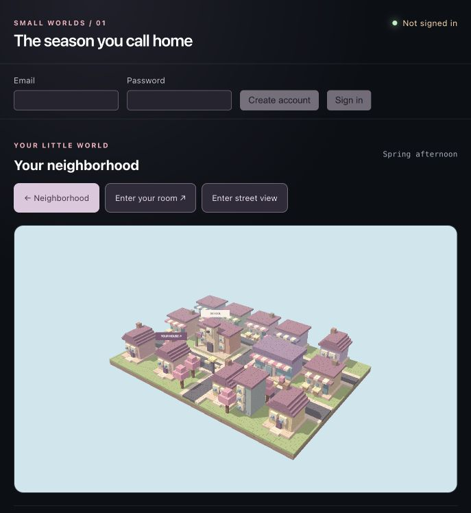
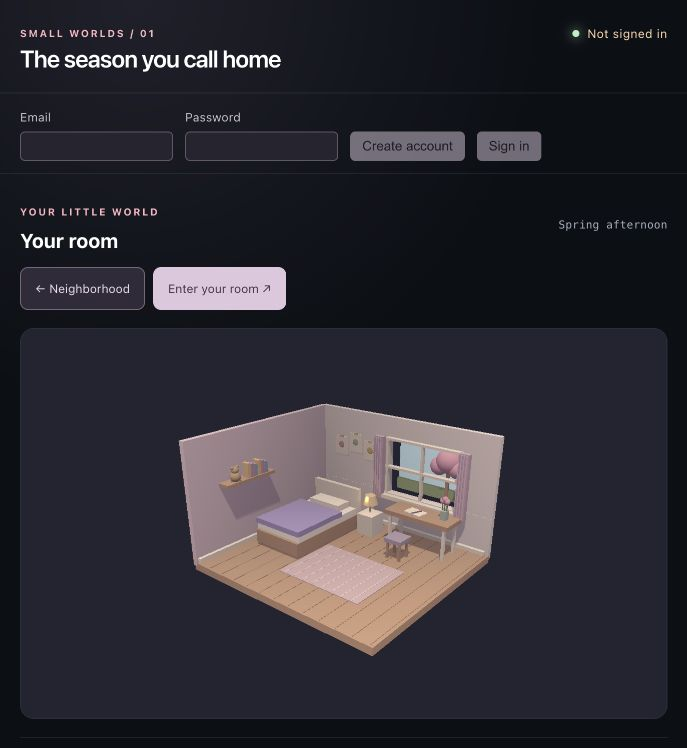
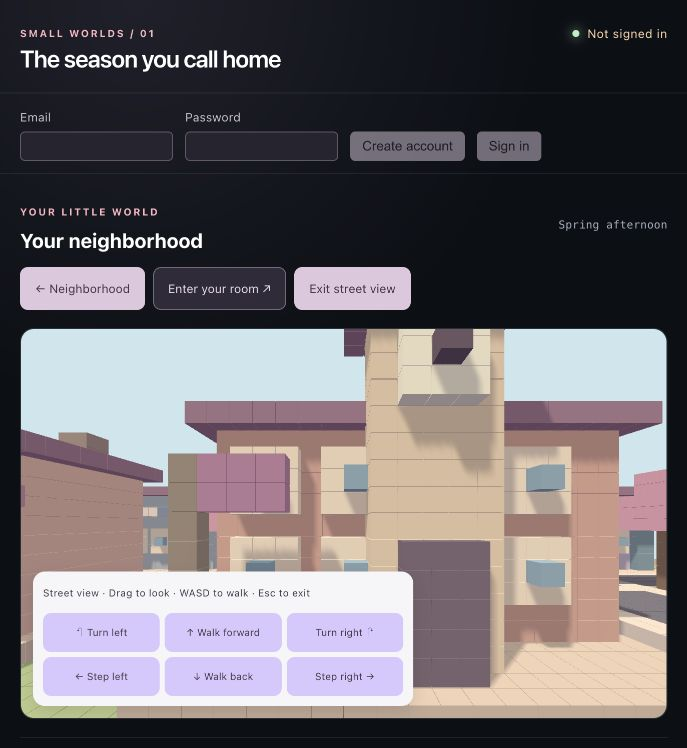
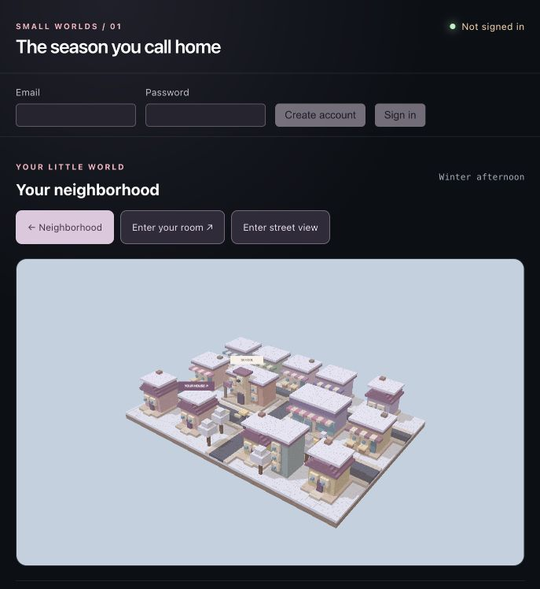
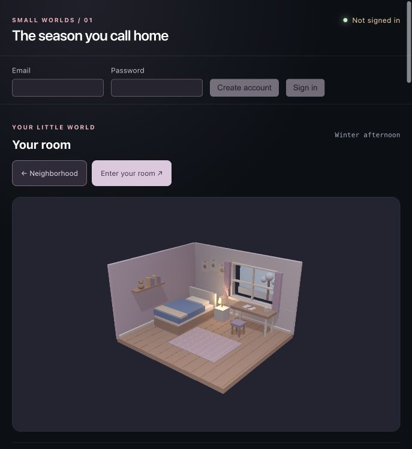
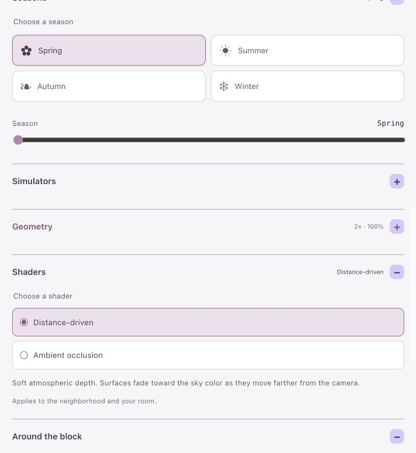

# World rules — The season you call home

Last checked against the implementation: October 7, 2026.

This document describes the current playable prototype, including its limits. Earlier game ideas are not rules unless implemented here. The source files linked below remain the authority when behavior changes.

## 1. World and starting state

You explore a pastel voxel neighborhood and can enter your furnished bedroom. The world uses second-person wording: “your house,” “your room,” and “your neighborhood.”

The neighborhood layout is fixed. Code constructs its shapes procedurally, but each session does not generate a different town. There is currently no character avatar, NPC schedule, dialogue, relationship system, quest, shopping transaction, scoring, or win condition.

On a fresh page load:

| Setting | Default |
| --- | --- |
| View | Neighborhood overview |
| Season | Spring |
| Street view | Off |
| Voxel density | 2× |
| Render resolution | 100% |
| Shader | Distance-driven |
| All five simulations | Paused |
| Puddle coverage, new snow, plant growth, mist | Zero |

## 2. Places and labels



*Neighborhood overview in spring. School and your house keep permanent signs; other buildings reveal their names on hover. The layout stays the same across seasons.*

| Place | Current interaction |
| --- | --- |
| Your house | Permanent **YOUR HOUSE ↗** sign; click the house or sign to enter your room |
| School | Permanent **SCHOOL** sign; exterior only |
| Petal Mall | Name on hover; exterior only |
| Peach Blossom Café | Name on hover; exterior only |
| Moonlight Noodles | Name on hover; exterior only |
| Sugar Cloud Bakery | Name on hover; exterior only |
| Little Chapter Bookshop | Name on hover; exterior only |
| Petal & Stem Florist | Name on hover; exterior only |
| Ribbon Boutique | Name on hover; exterior only |
| Maple House | Name on hover; exterior only |
| Lavender House | Name on hover; exterior only |
| Rosewood House | Name on hover; exterior only |
| Sunflower House | Name on hover; exterior only |
| Willow Apartments | Name on hover; exterior only |

Hover names appear for the visible building under the pointer. Tapping/clicking a named exterior can also reveal its name. Dragging the view hides the tooltip. Home and school retain their permanent signs instead of duplicate hover tooltips.

The original decorative flower-bed blocks in front of your house were removed. Plants added by the growth simulation are separate and may still appear in the garden there. Shop decorations remain.

## 3. Navigation

### Overview and bedroom

- Drag to orbit; scroll to zoom.
- **Enter your room** opens the bedroom from anywhere in the neighborhood; proximity is not required.
- Clicking your house or its sign also opens the bedroom.
- **Neighborhood** returns outside.
- Season, shader, resolution, simulation settings, and simulation progress are shared between both views.
- Simulations can continue while you are inside, even when their neighborhood effects are not visible.
- Buildings other than your house have no enterable interiors yet.



*Enter your house to reach this room. The spring furnishings are a seasonal preset, not the plant-growth simulation.*

### Street view



*Street view lowers the camera to the road. Use the on-screen buttons or keyboard to move and return to the overview with Exit street view.*

Select **Enter street view** from the neighborhood navigation to switch to a ground-level camera.

| Control | Action |
| --- | --- |
| Mouse drag | Look around |
| W / Up arrow | Walk forward |
| S / Down arrow | Walk backward |
| A / D | Step sideways |
| Left / Right arrow | Turn |
| On-screen buttons | Walk, step sideways, or turn in discrete increments |
| Escape, with preview focused | Return to overview |
| Exit street view | Return to overview |

Keyboard movement is scoped to the preview canvas. Click the preview to focus it after using other controls. Losing focus clears held movement keys.

Movement follows connected street corridors and stops at their boundaries. It is not unrestricted walking through buildings, yards, or interiors. There is no jumping or vertical movement.

Technical movement rules:

- Entry position: `(-5, 1.9, 0.6)`, facing north (`-Z`).
- Camera height stays at `1.9`; street-view field of view is `65°`.
- Keyboard walking speed is `2.5` world units per second. Diagonal movement is normalized.
- On-screen movement advances `0.65` units per click; turn buttons rotate `0.25` radians.
- Keyboard turning is `1.6` radians per second; vertical looking is clamped to ±`0.65` radians.
- Walkable outer limits: `X = -12.6…12.6`, `Z = -7.5…6.1`.
- Within those limits, walking is allowed on the main street (`Z = -0.5…1`), central street (`X = -0.25…1`), or rear street (`Z = -7.5…-6.5`).
- Exiting restores the overview camera saved at entry.
- Re-entering starts at the entry point again. Rebuilding voxel geometry also restarts the street position.
- The street-view selection remains set when visiting the room, so returning outside may return to street view.

## 4. Seasons

The season buttons and season slider select the same four states. Seasons do not advance automatically. Switching season updates both views immediately without replacing the neighborhood layout.

| Season | Neighborhood / window | Bedroom |
| --- | --- | --- |
| Spring | Pink blossoms, green ground, soft warm light | Light lilac quilt; desk flowers |
| Summer | Green foliage, blue sky, brighter sunlight | Thin peach cover; desk fan |
| Autumn | Copper foliage, muted sky, warmer light | Rust quilt, folded throw, desk pumpkin |
| Winter | Pale foliage, snowy ground and base roof snow, cooler light | Thick blue quilt, throw, mug, brighter bedside lamp |

These are seasonal presets. Their base snow, colors, and furnishings do not depend on simulation progress. Resetting the snow simulation does not remove winter’s preset snow.



*Winter changes the neighborhood palette and adds base snow even when the snow simulation is paused. This screenshot demonstrates the season preset, not accumulated simulated snowfall.*



*The selected season follows you inside: compare the bedding, desk objects, lighting, and view through the window with the spring room above.*

### Simulation availability

| Simulation | Spring | Summer | Autumn | Winter |
| --- | --- | --- | --- | --- |
| Rain | Available | Available | Available | Unavailable |
| Snow | Unavailable | Unavailable | Unavailable | Available |
| Wind | Available | Available | Available | Available |
| Seasonal plant growth | Available | Available | Unavailable | Unavailable |
| Fog & humidity | Unavailable | Unavailable | Unavailable | Available |

Unavailable simulation controls are disabled, including reset. Their clocks and progress are held, not erased. A simulation that was playing resumes when you return to a supported season. Rain particles disappear in winter; simulated snow and mist disappear outside winter. Existing plants and puddles remain visible even when their simulation is seasonally unavailable.

## 5. Shared simulation behavior

Each simulation has its own **Play/Pause**, **Reset**, clock, and accumulated state.

- Play advances only that simulation when its season permits it.
- Pause freezes its time and progress; it does not clear the result. Falling particles can remain frozen in place.
- Reset clears that simulation’s clock and accumulated result and pauses it. Slider settings remain unchanged.
- Resetting one simulation does not reset another.
- Wind intentionally affects moving rain and snow, as described below.
- Changing a slider changes its configured effect; pause is not a lock on editing settings.
- State such as coverage, growth, and mist is bounded between 0 and 100%.
- Model updates run about every 100 ms, using elapsed time capped at 0.25 seconds per update. Background-tab throttling or a slow device can make real-world progress slower; there is no offline catch-up.

The percentages below are slider settings, not probabilities. Formulas use decimal fractions: `50% = 0.5`, with `dt` measured in simulation seconds.

## 6. Rain and puddles

**Default intensity:** 60%. **Range:** 0–100%, in 5-point steps.

Rain produces falling streaks outside. In the bedroom it appears beyond the window. Puddles are visible only on neighborhood street tiles.

While rain is playing in a supported season:

```text
coverage change = (intensity × 0.004 − 0.0006) × dt
```

Coverage is clamped to 0–1. The visible puddle tile area scales with the coverage value, including a partially filled final tile. The readout displays one decimal place.

| Intensity | Coverage change per second |
| --- | --- |
| 0% | −0.06 percentage points |
| 15% | No net change |
| 25% | +0.04 percentage points |
| 50% | +0.14 percentage points |
| 60% (default) | +0.18 percentage points |
| 100% | +0.34 percentage points |

At the default setting, approximately 1% coverage takes 5.6 simulation seconds; full coverage takes about 9 minutes 16 seconds from dry. To dry puddles, keep rain playing and set intensity to zero. Pausing freezes coverage, including drying.

Puddles use a fixed tile-fill ordering. They are a coverage visualization, not simulated downhill water flow, flooding, or mirror reflections. Humidity and snowmelt currently do not change puddle coverage.

## 7. Snow

**Default snowfall:** 50%. **Range:** 0–100%, in 5-point steps.

**Default temperature:** −2°C. **Range:** −10°C to 15°C, in 1°C steps.

While snow is playing in winter:

```text
new snow change = (snowfall × 0.025 − max(0, temperature) × 0.0015) × dt
```

- Below or at freezing, this model has no melting term.
- Above freezing, melting competes with accumulation. Snow can still increase if snowfall exceeds melting.
- Set snowfall to zero and temperature above zero while playing to melt accumulated snow.
- Snowfall particles and added roof layers are separate from winter’s base snow.
- Additional simulated roof accumulation is currently modeled on the school, mall, your house, and Maple House. The bedroom shows accumulation at the window. It is not a full accumulation model for every new building.
- Default accumulation is 1.25 percentage points per second, reaching full added snow in approximately 80 simulation seconds.

## 8. Wind and precipitation direction

**Default strength:** 50%. **Range:** 0–100%, in 5-point steps.

**Default direction:** 45°. **Range:** 0–360°, in 5° steps.

| Direction | World direction |
| --- | --- |
| 0° / 360° | East, +X |
| 90° | South, +Z |
| 180° | West, −X |
| 270° | North, −Z |

Wind carries leaf particles and sways simulated garden plants. These are visual effects; wind does not damage buildings or uproot plants.

When wind and precipitation are both playing:

```text
wind speed = strength × 4 world units/second
rain horizontal speed = wind speed
snow horizontal speed = wind speed × 0.8
```

Horizontal motion is integrated over time, so changing direction steers particles without relocating them according to their entire elapsed lifetime. Rain streaks lean along their falling trajectory. Snow falls more slowly, making sideways drift more apparent.

Pausing wind stops new wind-driven drift for running precipitation on its next update; precipitation then falls vertically. Pausing rain or snow freezes its own particles even if wind keeps playing. Existing offsets are preserved. Resetting wind does not erase precipitation progress or displacement.

Leaf drift and plant sway use the wind clock. Their motion freezes when wind pauses. Editing strength or direction while paused can still change their static appearance.

## 9. Seasonal plant growth

**Default speed:** 50%. **Range:** 0–100%, in 5-point steps.

Growth adds actual plants, one by one, at 24 fixed neighborhood garden positions in two rows near your house. There are no simulated room plants. The bedroom’s seasonal desk flowers remain part of its decor.

```text
growth change = speed × season multiplier × 0.002 × dt
visible plant count = floor(growth × 24), capped at 24
spring multiplier = 1.0
summer multiplier = 0.8
```

Only spring and summer advance growth. Existing plants remain in autumn and winter, but no new ones appear. The speed percentage controls rate, not the final plant count.

| Speed | Spring: one new plant every | Summer: one new plant every |
| --- | --- | --- |
| 0% | No growth | No growth |
| 25% | 83 seconds | 104 seconds |
| 50% (default) | 42 seconds | 52 seconds |
| 75% | 28 seconds | 35 seconds |
| 100% | 21 seconds | 26 seconds |

Times are approximate active simulation time at a constant setting. At default speed, all 24 plants take about 16 minutes 40 seconds in spring or 20 minutes 50 seconds in summer.

Plants also mature slightly after appearing. Flower tops become visible once overall growth exceeds 45%, except in winter. Leaf colors follow the selected season, and wind can sway plants. Rain, puddles, temperature, and humidity do not currently alter growth speed. Reset removes all simulation-grown plants and returns the count to zero.

## 10. Fog and humidity

**Default humidity:** 70%. **Range:** 0–100%, in 5-point steps. Winter only.

While playing:

```text
mist change = (humidity − current mist) × min(1, dt × 0.4)
```

Mist gradually approaches the humidity setting. Setting humidity to zero while playing clears it gradually; reset clears it immediately. Pause holds the current mist.

In the neighborhood, mist is visible above 1% and uses fog density `mist × 0.025`. In the room, it appears as a translucent layer beyond the window instead of filling the bedroom. Fog takes its color from the seasonal sky.

Humidity currently controls mist only. It does not change plant growth, drying, temperature, or snowfall.

## 11. Geometry and shaders

### Voxel density

- Range: **1×–4×**, whole-number steps; default **2×**.
- Changes the neighborhood’s architecture and terrain block subdivision, not its layout.
- Nominal voxel unit size is `0.5 / density`: 0.5, 0.25, approximately 0.167, or 0.125 world units.
- Shapes retain their overall dimensions; individual axes are subdivided to fit.
- Does not voxelize the bedroom or change the independent weather tile/particle meshes.
- Higher density adds geometry. Small gaps between voxels remain by design.

### Render resolution

- Range: **25%–150%**, in 25-point steps; default **100%**.
- Applies to both views and their shader passes.
- Changes drawing-buffer resolution, not the CSS preview size or world geometry.
- Pixel ratio is `min(device pixel ratio, 2) × resolution / 100`.
- Lower values look more pixelated; higher values use more graphics resources.

### Shaders

Only one shader option is selected at a time, shared across both views.

| Mode | Current effect |
| --- | --- |
| Distance-driven (default) | Surfaces fade toward the background with camera distance |
| Ambient occlusion | Broad screen-space shading around sheltered surfaces and corners |

Distance-driven atmospheric fading is a rendering option available in every season. It is distinct from the winter-only fog simulation. When simulated neighborhood mist is present, it replaces the distance fog; occlusion can still be applied.

High voxel density can reveal patchiness from small voxel gaps, overlapping street surfaces, or occlusion. Continuous-road cleanup has been discussed but is not implemented.

## 12. Controls, persistence, and current limits



*The + buttons reopen minimized sections. Shaders currently offers only Distance-driven and Ambient occlusion; changing or collapsing a panel does not reset simulation progress.*

- Seasons, Simulators, Geometry, Shaders, Around the block, and Inside & outside can be collapsed and reopened. Individual simulations also have collapsible sections.
- Collapsing a section does not pause its simulation or clear settings.
- Settings and progress persist while switching views in the current page session.
- There is no world save/load or cross-session simulation persistence. Reloading the page returns world state to defaults.
- Email/password account creation, sign-in, and sign-out are available through Firebase. A basic user profile may be created on sign-in; it does not save the world.
- Exploration is not gated by signing in.
- WebGL is required for the rendered scenes; a fallback message appears if a renderer cannot be created.
- Weather is a simplified visual model. There is no full fluid simulation, temperature forecast, terrain erosion, plant ecology, or automatic season/day-night cycle.

## 13. Implementation references

The demonstration screenshots above were captured from the running app on October 7, 2026. They are stored in `docs/images/` so the illustrations remain available with the repository. Refresh them when the visible behavior changes; they are examples, not saved world states.

| File | Responsibility |
| --- | --- |
| [src/App.jsx](src/App.jsx) | Shared state, defaults, model update loop, view navigation, control layout |
| [src/seasons.js](src/seasons.js) | Seasonal colors and descriptions |
| [src/NeighborhoodCanvas.jsx](src/NeighborhoodCanvas.jsx) | Neighborhood layout, buildings, labels, hover picking, voxel subdivision |
| [src/RoomCanvas.jsx](src/RoomCanvas.jsx) | Bedroom geometry and seasonal furnishings |
| [src/streetView.js](src/streetView.js) | Ground-level camera, movement, street boundaries |
| [src/weatherSimulation.js](src/weatherSimulation.js) | Availability, independent clocks, reset behavior, numerical rules |
| [src/weatherScene.js](src/weatherScene.js) | Precipitation, puddle tiles, added snow, plants, wind visuals, mist |
| [src/WeatherControls.jsx](src/WeatherControls.jsx) | Simulation controls, ranges, readouts, seasonal disabling |
| [src/worldShaders.js](src/worldShaders.js) | Distance and ambient-occlusion rendering |
| [src/ControlSection.jsx](src/ControlSection.jsx) | Collapsible sections |
| [src/auth.js](src/auth.js), [src/profile.js](src/profile.js) | Authentication and basic profile records |

Update this document whenever the implemented rules change. Keep proposed features separate from current behavior.
